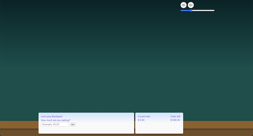
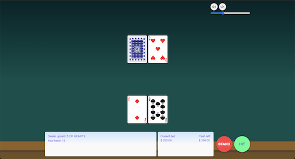
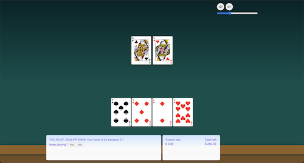
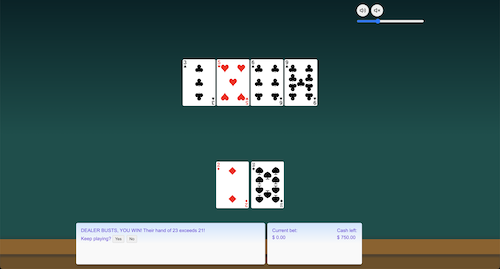
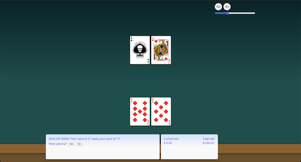

# ♣️ ♥️ Blackjack ♦️ ♠️

Blackjack is a card game where the goal of the player (you) is to have a hand that totals as close to 21 as possible, without going over. You're opponent is the dealer, who also plays by the same rules. There's some strategy involved, and you can win as quickly as you can lose. This likely contributes to Blackjack's popularity in casinos, but you can also play it for fun!

## Technologies Used

|  **HTML** |  **CSS** |  **JavaScript** |
| :-------------------------------------------------------------------------------------------------------------------------------------------------------------------: | :---------------------------------------------------------------------------------------------------------------------------------------------------------: | :-----------------------------------------------------------------------------------------------------------------------------------------------------------------------: |

## Getting Started + Screenshots

Play my Blackjack game [here](https://agviray.github.io/blackjack/)!

Once the page loads, you'll see the content shown below. You'll start with $500.00 (and hopefully leave with more!). Enter your bet and click the "Bet" button to begin.

The dealer will deal 2 cards to themself and 2 cards to you. From here, you have two options:

- STAND: Clicking STAND means that you are satisfied with your cards (your "hand"). After selecting this option, the dealer will proceed to deal cards for themself.
- HIT: Clicking HIT means that you would like to attempt to get another card to bring your hand closer or equal to 21. The dealer will draw another card for you. At this point, you have the option to HIT again, or STAND.

  - Note: You can HIT as many times as you want in order to get your hand as close to 21 as possible. If you no longer want cards to be drawn for you, click the option to STAND.

If you choose to HIT several times and your cards exceed 21, that means you "BUST", and the dealer wins the round.

When you STAND, the dealer will have to draw cards for themself. Blackjack table rules can vary, but typically the dealer has to continue drawing cards to themself if their hand is less than 17. If the dealer's hand exceeds 21, they BUST, and you win the round.

Sometimes you or the dealer will get an initial hand that totals 21. This is a "Blackjack"! Whoever received a Blackjack in this scenario would be the winner of the round. If both you and the dealer receive Blackjacks, then the result is a "PUSH", which essentially means a draw. At this point, you can choose to play another round.

## Next Steps

Planned features to add:

- [x] Update Ace value of 1 or 11, depending on current hand
- [x] Set sound effects on player actions and round results
- [ ] Add "split" option
- [ ] Add "double down" option
- [ ] Allow user to "Buy In" with desired amount
- [ ] Replace input betting with clickable chips or drag-and-drop chips
- [ ] Implement a triple card deck for dealer to draw from
- [ ] Implement feature to allow up to 4 players
- [ ] Integrate different music to choose from
- [ ] Update various styles to a more themed/sleek display (ie card flips, UI)
- [ ] Add a title screen
